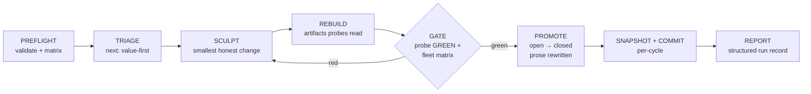

# recurve

**Turn a spec or a README into promises a machine can check — then let an
agent loop build until every promise is proven, without ever un-proving one.**

AI agents write code faster than anyone can review it. The bottleneck is no
longer *producing* changes — it's *knowing what's actually true* about the
result. recurve makes truth executable: every promise becomes a **claim** with
an executable **probe** that answers GREEN (proven), RED (not yet), or BROKEN
(couldn't measure). An agent loop turns the most valuable RED claim GREEN, then
must pass the **full gate** — every previously proven claim still GREEN — before
the work counts. Proven claims keep their probes forever, so nothing regresses
silently.

You review *promises and decisions*; agents own everything between a RED probe
and a green gate; the code ships with its evidence.

## The loop



More in [Architecture](https://bordumb.github.io/recurve/developer_guide/architecture/).

## Install

Requires Python 3.11+ (only dependency, PyYAML, installs automatically).

```bash
# uv
uv tool install git+https://github.com/bordumb/recurve.git

# or pip
pip install git+https://github.com/bordumb/recurve.git

recurve --help
```

Full options (editable clone, PATH symlink) in the
[Installation guide](https://bordumb.github.io/recurve/user_guide/install/).

## Use it — Claude Code skills

`recurve install` puts two global skills into `~/.claude/skills/`, so they work
in any repo with no per-repo setup:

- **`/recurve-plan`** — `recurve init` the repo, then interview you toward a
  `docs/PRD.md` that passes the admission gate (`recurve admit`).
- **`/recurve-work`** — run the burndown loop under the gate; endless-until-done
  or stop for your approval after each claim.

```bash
cd your-project
/recurve-plan     # get to a gate-ready plan
/recurve-work     # burn it down
```

That's the whole workflow. Details:
[Claude skill](https://bordumb.github.io/recurve/user_guide/usage-claude-skill/) ·
[Provider-agnostic](https://bordumb.github.io/recurve/user_guide/usage-provider-agnostic/)
(any agent harness, no Claude required).

## Reports & status

recurve writes down everything the loop does, so you never trust a transcript:

```bash
recurve status      # open/closed counts + the true gate verdict
recurve report      # deterministic progress, ETA, and a diff-honesty scan
recurve stats       # close rates, attempts, cost — from the run records
```

`report` is free and deterministic (`--narrate` adds optional LLM prose). See
[Reports & status](https://bordumb.github.io/recurve/user_guide/reports-and-status/) and
[Run data & trajectories](https://bordumb.github.io/recurve/user_guide/run-data/).

## Academic backing

recurve is the toolkit form of a framework built on one load-bearing rule:
**no check may certify work until it has been demonstrated able to fail.** Every
claim's probe is admissible only once it has rejected a known-bad
counterexample — a **trap** — with an opt-in fuzz pass measuring each probe's
false-positive rate. A **gate** the working agent cannot influence aggregates
the probes; a deterministic controller, never the agent, decides when the work
is done. The guarantee is explicitly *graded* — strongest where a probe bottoms
out in a sound oracle, weakest where it is an authored artifact, which is
exactly where the falsification discipline buys trust back. The framework is
self-hosted: recurve's own development is gated by these mechanisms, and the
audit trail is reproduced from its ledger.

Full treatment, with the 2025–2026 verification literature it positions
against, is in the
**[Whitepaper](https://github.com/bordumb/recurve/blob/main/docs/papers/recurve-framework.pdf)**.

## Docs

Everything else — hardening probes, multi-repo federation, claim packs,
evidence receipts — is on the
**[documentation site](https://bordumb.github.io/recurve/)**.
