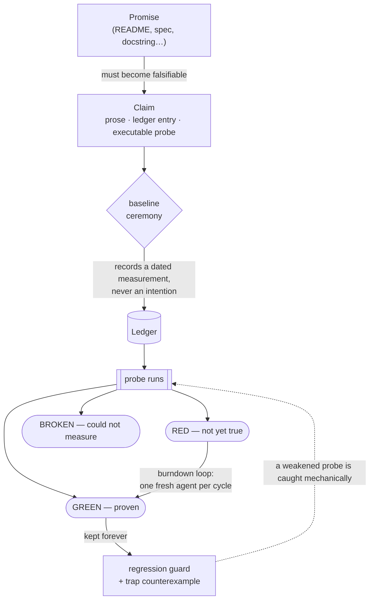
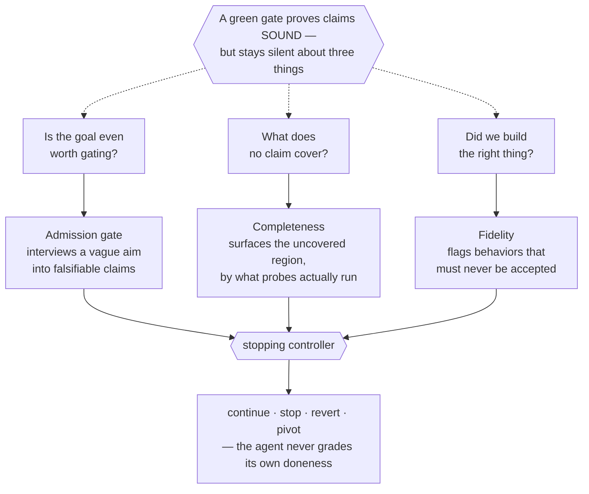
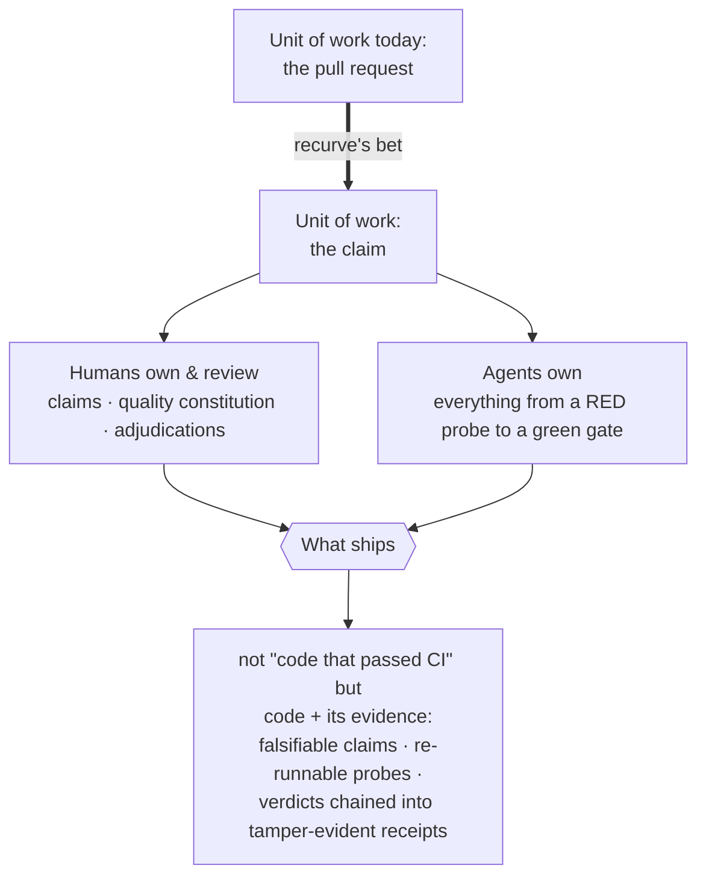

# About

## The problem

Software makes promises everywhere — READMEs, specs, docstrings, launch
decks — and almost none of them are *checkable*. Tests cover what developers
remembered to test; documentation drifts from reality the day it's written;
and when agents start writing the code, the question "why should I trust
this?" has no good answer beyond "the diff looked fine."

Recurve is named as a combination of the "re-" in "recursive" and "curve", which embodies the nature of sculpting and curving something into shape over time.

## What recurve does

recurve makes promises **falsifiable, then keeps them that way**:

- Every promise becomes a **claim**: prose a human owns, a ledger entry a
  machine reads, and an **executable probe** that emits GREEN (proven), RED
  (not yet true), or BROKEN (could not measure). If it can't be probed, it
  isn't a claim yet.
- Nothing enters the ledger except through the **baseline ceremony**: drafts
  are intentions; the ledger records *measurements* — actual, dated output.
- Closed claims keep their probes forever as **regression guards**, and every
  probe keeps a **trap** — a counterexample it must turn RED — so a weakened
  probe is caught mechanically. A probe that has never been seen to fail is
  not yet evidence.
- A **burndown loop** works the backlog: one fresh agent per cycle takes the
  highest-value RED claim and turns it GREEN without breaking any guarded
  other. The fleet gate is the arbiter; the ledger is the only memory.

## Beyond soundness

Proving a claim GREEN makes it **sound** — but a sound gate stays silent about three things, and recurve
closes each:

- **Is the goal even worth gating?** An *admission* gate refuses a goal too vague to become falsifiable
  claims and interviews you toward one, instead of burning a fuzzy aim into a brittle proxy.
- **What does no claim cover?** A *completeness* half surfaces the uncovered region of a target — measured by
  what a probe actually runs, not what a claim declares — so a green gate can never quietly hide a hole.
- **Did we build the right thing?** A *fidelity* check tracks behaviors that must never be accepted; if one
  slips through, the cycle is flagged as diverged no matter how green the probes are.

A stopping *controller* reads these measurements and decides — continue, stop, revert, or pivot — so the
agent doing the work never grades its own doneness. Wired together, that loop runs on a real repository:
git-backed snapshots and revert-to-last-green, a write boundary that keeps the agent off its own probes, and
a BYO agent behind a stable seam. The deciding logic is deterministic; the LLM pieces around it are pluggable.
See [The verification layer](verification-layer.md).

## The bet

If this shape installs anywhere, the unit of software work stops being the
pull request and becomes the **claim**. 

Humans own three artifacts — the
claims, the quality constitution, and the adjudications — and review *those*.

Agents own everything between a RED probe and a green gate. The artifact that
ships is not "code that passed CI" but **code accompanied by its evidence**:
a ledger of falsifiable claims, each with a probe anyone can re-run, each
verdict chained into a tamper-evident receipt.

## What recurve is not

- **Not a test framework.** Probes are plain executables in any language;
  recurve supplies the epistemics around them — ceremony, gate, traps,
  triage — not an assertion library.
- **Not an agent.** recurve is the harness agents run inside. Any agent that
  can read a prompt and write a JSON record can drive a cycle; a human
  following `RUN.md` works too.
- **Not a CI replacement.** It runs happily *in* CI (`--gate` flags are
  machine-meaningful), but its job is deciding what "better" means and
  proving movement toward it — not orchestrating builds.

## The system distrusts itself

recurve hosts itself: its own promises (the probe contract's totality, the
lock's refusal, the tamper-evidence of receipts, the equivalence to the
instances it was extracted from) live in a claims suite guarded by the same
gate it offers everyone else. A claims tool whose own claims aren't probed
would be a joke at its own expense.

It goes one step further: it **runs its own loop on its own repo**. `recurve run`
drives recurve's development on the recurve tree itself — a fresh agent per cycle,
each stop decided by the controller, each change proven by the gate before it
lands. The tool improves itself the way it asks you to improve anything. Recurve
walks the walk.
