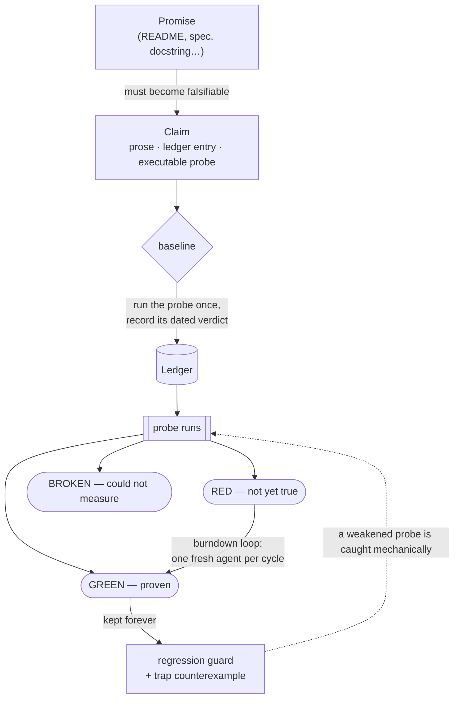
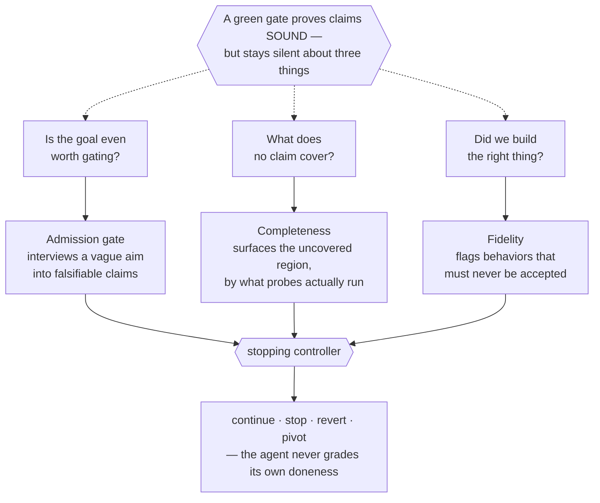
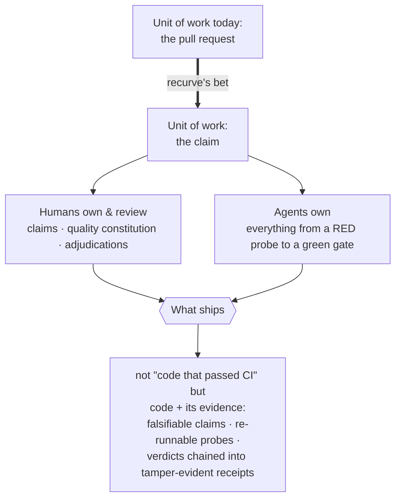

# About

## The problem

Software makes promises everywhere — READMEs, specs, docstrings, launch
decks — and almost none of them are *checkable*. Tests cover what developers
remembered to test; documentation drifts from reality the day it's written;
and when agents start writing the code, the question "why should I trust
this?" has no good answer beyond "the diff looked fine."

Recurve is named as a combination of the "re-" in "recursive" and "curve", which embodies the nature of sculpting and curving something into shape over time.

## What recurve does

recurve makes promises **falsifiable, then keeps them that way**. The diagram
traces a single promise through the system:

- **A promise becomes a claim.** Any promise — a line in a README, a spec, a
  docstring — is turned into a *claim*: a sentence a human owns, an entry a
  machine reads, and an **executable probe** that settles the sentence by
  *running*. The probe returns one of three verdicts — **GREEN** (true now),
  **RED** (not true yet), or **BROKEN** (it couldn't even measure: a missing
  build, a crashed check). No probe, no claim — it stays a draft.
- **`baseline` is how a claim earns its ledger entry.** A draft is only an
  intention. A claim enters the ledger through *baseline* — the step that runs
  its probe once and records the **actual, dated verdict** it produced. The
  ledger stores measurements, never hopes: nothing is "tracked" until it has
  really been checked at least once.
- **Every green is defended; every probe must be able to fail.** A closed claim
  keeps its probe forever as a **regression guard**, re-run each cycle so a
  change that quietly breaks it is caught. And every probe carries a **trap** —
  a known-bad input it is *required* to turn RED. A probe never seen to fail
  proves nothing, so weakening a probe until it passes everything makes its trap
  stop failing, and the tampering is caught mechanically. Opt in further and
  the checks are *measured*, not just spot-proven: generated known-bads yield a
  per-probe false-positive rate ([hardening](user_guide/hardening.md)).
- **The burndown loop clears the backlog.** Each cycle a *fresh* agent takes the
  highest-value RED claim and turns it GREEN without breaking any guarded claim.
  The **gate** — every probe plus its trap — is the arbiter of what may land;
  the ledger is the only memory an agent carries between cycles.

## Beyond soundness

Proving a claim GREEN makes it **sound** — the promise really holds. But
soundness is silent about three things a green gate alone cannot see, and recurve
adds a check for each (the three branches above):

- **Is the goal even worth gating?** Before any probing, an **admission** check
  refuses a goal too vague to become falsifiable claims and *interviews* you
  toward one — so a fuzzy aim is never burned into a brittle, gameable proxy.
- **What does no claim cover?** A **completeness** check surfaces the part of the
  target that *no probe touches* — measured by what probes actually run, not by
  what claims declare — so an all-green gate can't quietly hide a hole.
- **Did we build the right thing?** A **fidelity** check watches for behaviors
  that must *never* be accepted; if one slips through, the cycle is flagged as
  **diverged**, however green the probes are.

These three feed a **stopping controller** — the box every measurement flows
into. It reads them (gate, coverage, divergence) and decides the next move:
continue, stop, revert, or pivot. That is the point: the agent doing the work
never grades its own doneness — a separate, deterministic controller does. Wired
together, the loop runs on a real repository: git-backed snapshots with
revert-to-last-green, a write boundary that keeps the agent off its own probes,
and a bring-your-own agent behind a stable seam. The deciding logic is
deterministic; the LLM pieces around it are pluggable. See
[The verification layer](developer_guide/verification-layer.md).

## The bet

recurve's bet: if this shape installs anywhere, the **unit of software work
stops being the pull request and becomes the claim** — the thing you propose,
defend, and ship is a falsifiable statement, not a diff.

That redraws who owns what — the two lanes in the diagram. **Humans own three
artifacts**, and review only those: the **claims** (what must be true), the
**quality constitution** (the standing rules every cycle obeys), and the
**adjudications** (the judgment calls a gate can't make). **Agents own
everything between a RED probe and a green gate** — the mechanical work of
turning a claim true.

And what ships changes with it: not "code that passed CI," but **code
accompanied by its evidence** — a ledger of falsifiable claims, each with a
probe anyone can re-run, each verdict chained into a tamper-evident **receipt**.
The reviewer never has to take the diff's word for it.

## What recurve is not

- **Not a test framework.** Probes are plain executables in any language;
  recurve supplies the epistemics around them — baseline, gate, traps,
  triage — not an assertion library.
- **Not an agent.** recurve is the harness agents run inside. Any agent that
  can read a prompt and write a JSON record can drive a cycle; a human
  following `RUN.md` works too.
- **Not a CI replacement.** It runs happily *in* CI (`--gate` flags are
  machine-meaningful), but its job is deciding what "better" means and
  proving movement toward it — not orchestrating builds.

## The system distrusts itself

recurve hosts itself: its own promises (the probe contract's totality, the
lock's refusal, the tamper-evidence of receipts, the equivalence to the
instances it was extracted from) live in a claims suite guarded by the same
gate it offers everyone else. A claims tool whose own claims aren't probed
would be a joke at its own expense.

It goes one step further: it **runs its own loop on its own repo**. `recurve run`
drives recurve's development on the recurve tree itself — a fresh agent per cycle,
each stop decided by the controller, each change proven by the gate before it
lands. The tool improves itself the way it asks you to improve anything. Recurve
walks the walk.

## Further reading

The full technical treatment — the formal model of the gate, the oracle-spectrum
thesis, the self-hosted record, and positioning against the 2025–2026
verification literature — is the paper:
[**recurve: a falsifiability-gated framework for autonomous, verifiable
problem-solving** (PDF)](papers/recurve-framework.pdf).
