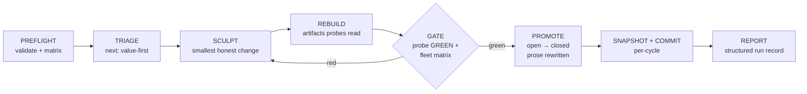
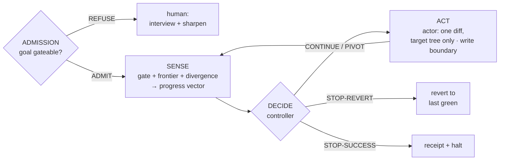

# Architecture

## Vocabulary (one term, one meaning)

| Term | Meaning |
| --- | --- |
| **Claim** | A falsifiable statement about the target. Exists in three synchronized places: prose (`GAPS.md`), ledger entry (`gaps.yaml`), probe. |
| **Gap** | A claim whose probe is RED — the delta between claimed and proven. A *closed* gap is GREEN and guarded forever. |
| **Probe** | An executable: exit 0 GREEN · 1 RED · anything else BROKEN. The map is total — a crash is never a verdict. |
| **Trap** | A kept counterexample fixture the probe must turn RED. Mutation testing for the spec layer. |
| **Suite** | One ledger + prose + probes + harness for one domain. |
| **Ledger** | `gaps.yaml` — the machine record of verified observations, never intentions. |
| **Gate** | The conjunction that must hold to promote: probe GREEN + fleet matrix (no regression / broken / stale / failed trap) + behavioral harness. |
| **Cycle** | One fresh agent taking the ledger from N red to N−k, proven, snapshotted, committed. |
| **Park** | Marking a gap un-greenable-this-run for human triage; the loop continues past it. |

## The loop



One cycle = one agent. The ledger is the only memory the next agent gets —
no context rot, contained failures, per-cycle rollback. Deterministic control
flow (caps, watchdogs, parking) lives in the orchestrator scripts; judgment
lives in the agents.

## The epistemic boundaries

Three ceremonies keep the ledger honest:

1. **Baseline** — the only door into the ledger. A draft is promoted `open`
   only when its probe measured RED for real (the observation is quoted,
   dated), and `closed` only when GREEN *and* the probe has been seen RED
   against a trap. BROKEN blocks everything: absence of evidence is never a
   verdict.
2. **The gate** — the only door from `open` to `closed`. Fleet-wide: closing
   one claim must not loosen any other; closed claims' traps re-run so a
   probe that can no longer fail is itself a gate failure.
3. **Adjudication** — the only door for human policy. A decision lands in
   three synchronized places (ledger, prose, probe marker); retirement leaves
   a tombstone. A ledger that silently rewrites its past is no longer a
   record of observations.

## The verification layer

The loop above proves claims GREEN and guards them — **soundness**. A sound gate has three blind spots, and a
set of engine modules closes each; a fourth composes them into a loop that can run unattended.

- **Admission — is the goal even gateable?** Before a single claim exists, the admission gate asks whether a
  goal can become a faithful contract at all: each assertion must be *probe-able* — you can name a check that
  goes RED if it were false. A goal too vague is refused with a per-assertion worklist (an interview), never
  burned down into a brittle proxy. Verdict: `ADMIT` / `REFUSE-AND-INTERVIEW` / `REFUSE-NOT-GATEABLE`.
- **Completeness — what does no claim cover?** A sound gate says nothing about the surface no claim touches.
  Surface extraction enumerates a target's claimable points; measured coverage records which a probe actually
  *runs* (traced, not declared); the **frontier** is the ranked uncovered remainder. Greenness becomes
  *soundness ∧ completeness* — a cycle is not done while the frontier is nonempty; each uncovered point is
  claimed or explicitly deferred, never silently ignored.
- **Fidelity — did we build the right thing?** A probe can pass while the intent is broken. A
  *goal-counterexample* is a behavior that must never be accepted; if one is, the cycle has **diverged**, and
  no amount of green earns a success-stop.
- **Stopping — stop, revert, or move on.** A controller reads a measured *progress vector*
  (open / regressed / broken / uncovered / divergent) and returns exactly one verdict —
  `CONTINUE` / `STOP-SUCCESS` / `STOP-REVERT` / `PIVOT` — so *when to stop* is decided by measurement, never
  by the agent doing the work.

The **runtime** composes these into an autonomous burndown loop: **Sense** (gate + completeness + fidelity) →
**Decide** (the controller) → **Act** (a pluggable actor, reached only on an ADMITted contract and kept off
the referee surface by a write boundary) → revert-to-last-green. The verdict is a pure function of what was
measured; the actor's self-report is never an input.



A separate adversary periodically red-teams the new claims; anything it finds becomes a kept trap (the
capture rule) before the loop trusts it. One principle runs through it: **the spine is deterministic, the judgment is pluggable.** The parts that need
an LLM — the rater that reads a goal, the actor that writes a diff, the adversary that red-teams a claim —
sit behind protocols; everything that *decides* from their output is fixed and itself gated. That is what
lets the loop be trusted rather than believed: it measures instead of trusting itself, and refuses when it
cannot measure. Each module here is guarded by its own claims suite, hardened the same way the toolkit is
(see "The system distrusts itself" in [About](about.md)).

## Engine layout

```
recurvelib/            the engine (Python, stdlib + PyYAML only)
  config.py            recurve.toml — all per-target variability
  model.py             Gap/Ledger; parse-don't-validate boundary
  probe.py             runner: total exit map, timeouts, traps
  freshness.py         artifact currency — STALE blocks lying verdicts
  conformance.py       the matrix + the gate
  coverage.py          prose ↔ ledger drift check
  triage.py            value-first ordering; parallel lane dealing
  baseline.py          the promotion ceremony
  adjudicate.py        three-place decisions, amendment, retirement
  lock.py              one loop per tree, human-only steal
  parked.py            sidecar run state + attempt journals
  records.py           run records + hash-chained evidence receipts
  receipts.py          receipt emission, chain verification, pluggable signer
  claimify.py          PRD → draft claims (adversarial twins, forks)
  init.py              target scaffolding (blank / archaeology / claimify)
  pack.py              claim packs — claims as a distributable unit
  # the verification layer (deterministic spine; LLM parts are pluggable)
  admission.py         is the goal gateable? probe-ability, verdict, interview, synthesis guard
  surface.py           extract a target's claimable surface points (adapter-based)
  measured.py          which surface points a probe actually exercises (traced coverage)
  frontier.py          the ranked uncovered region — what no claim covers
  completeness.py      the completeness half of the gate: sound AND complete
  fidelity.py          goal-counterexamples → divergence (did we build the right thing?)
  controller.py        the stopping controller: stop / revert / pivot / continue, by measurement
  runtime.py           the autonomous burndown loop spine (Sense → Decide → Act → revert)
schema/                versioned: gap entry, run record, receipt
templates/             everything `init` stamps (docs, workflows, skills)
packs/                 shipped claim packs (cli-contract, perf-slo)
```

## Target layout (contained)

Everything recurve stamps lives in one dotdir; the target's root stays the
product's own domain:

```
<target>/
  .gitignore               # gains one entry: .recurve/state/
  .claude/skills/          # launcher / single-cycle / review skills
  .recurve/
    recurve.toml           # config (discovery also checks the repo root)
    RUN.md                 # the per-cycle agent contract
    RUN-AUTO.md            # unattended operation runbook
    REVIEW.md              # adversarial protocol for review-gated claims
    TROUBLESHOOTING.md     # symptom → rule → action
    quality.md             # the constitution the loop obeys, never edits
    claims/<suite>/        # GAPS.md · gaps.yaml · probes/ (+ traps) · harness/ · cycles/
    workflows/             # burndown.sh · burndown-parallel.sh · burndown.js
    state/                 # gitignored: parked gaps, run records, receipts
```

## Watchdogs (every rule was paid for)

The unattended loop halts **only** on: no work left, the cycle cap,
N consecutive failures, or runaway scope (consecutive net-gap-positive
cycles). An un-greenable gap is parked with an attempt journal — observations,
never conclusions — and the loop moves on. A tree lock makes a second
concurrent loop refuse to start; stealing the lock is a human-only act.

## Parallel lanes (v2)

`next --lanes N` deals up to N gaps from pairwise-disjoint suites; lanes
sculpt in isolated git worktrees; the **gate is the serialization point** —
candidates land on the real tree one at a time, each landing gate-checked
before promotion and commit; a failing candidate is reverted and discarded,
never merged.
