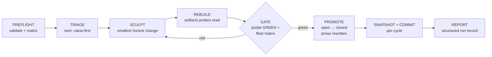

# Architecture

## The loop



One cycle = one agent. The ledger is the only memory the next agent gets —
no context rot, contained failures, per-cycle rollback. Deterministic control
flow (caps, watchdogs, parking) lives in the orchestrator scripts; judgment
lives in the agents.

## The epistemic boundaries

Three ceremonies keep the ledger honest:

1. **Baseline** — the only door into the ledger. A draft is promoted `open`
   only when its probe measured RED for real (the observation is quoted,
   dated), and `closed` only when GREEN *and* the probe has been seen RED
   against a trap. BROKEN blocks everything: absence of evidence is never a
   verdict.
2. **The gate** — the only door from `open` to `closed`. Fleet-wide: closing
   one claim must not loosen any other; closed claims' traps re-run so a
   probe that can no longer fail is itself a gate failure.
3. **Adjudication** — the only door for human policy. A decision lands in
   three synchronized places (ledger, prose, probe marker); retirement leaves
   a tombstone. A ledger that silently rewrites its past is no longer a
   record of observations.

## Beyond the base loop

The loop above proves claims GREEN and guards them — **soundness**. That is the
everyday model this page describes. A sound gate still has three blind spots
(*is the goal gateable? · what does no claim cover? · did we build the right
thing?*), and a **verification layer** closes each and decides *when the loop is
done* by measurement. It is its own subject — see
[The verification layer](verification-layer.md).

## Vocabulary (one term, one meaning)

**The claim model** — the objects the base loop's phases act on (`GATE` is the gate box; a `Cycle` is one
pass of the loop):

| Term | Meaning |
| --- | --- |
| **Claim** | A falsifiable statement about the target. Exists in three synchronized places: prose (`GAPS.md`), ledger entry (`gaps.yaml`), probe. |
| **Gap** | A claim whose probe is RED — the delta between claimed and proven. A *closed* gap is GREEN and guarded forever. |
| **Probe** | An executable: exit 0 GREEN · 1 RED · 3 SKIP · anything else BROKEN. The map is total — a crash is never a verdict. |
| **Trap** | A kept counterexample fixture the probe must turn RED. Mutation testing for the spec layer — extended, opt-in, by generated known-bads and isomorphic variants ([hardening](../user_guide/hardening.md)). |
| **Suite** | One ledger + prose + probes + harness for one domain. |
| **Ledger** | `gaps.yaml` — the machine record of verified observations, never intentions. |
| **Gate** | The conjunction that must hold to promote: probe GREEN + fleet matrix (no regression / broken / stale / failed trap) + behavioral harness. |
| **Oracle waiver** | Exit 3 = SKIP: the probe's external oracle is absent (not-applicable here). It blocks the gate like BROKEN *unless* the claim declares an `oracle_waiver` — then it is a visible, non-blocking skip. A probe can never silently dodge the gate. |
| **Reference oracle** | An optional stricter/slower check declared per claim (`reference:`); `drill --diff` runs both and alarms on disagreement. |
| **Cycle** | One fresh agent taking the ledger from N red to N−k, proven, snapshotted, committed. |
| **Park** | Marking a gap un-greenable-this-run for human triage; the loop continues past it. |
| **Branch** | A per-cycle record entry for the road *not* taken — a rejected decomposition or abandoned attempt, with its reason. Exported with [trajectories](../user_guide/run-data.md). |
| **Receipt** | A tamper-evident, hash-chained record of a verdict's evidence. See [Evidence & receipts](evidence.md). |

The verification layer adds its own vocabulary (admission, frontier, divergence,
the progress vector, the controller) — see
[The verification layer](verification-layer.md#vocabulary).

## Engine layout

```
recurvelib/            the engine (Python, stdlib + PyYAML only)
  config.py            recurve.toml — all per-target variability (target, sculpts, receipts seam)
  model.py             Gap/Ledger; parse-don't-validate boundary
  probe.py             runner: total exit map, timeouts, traps
  freshness.py         artifact currency — STALE blocks lying verdicts
  conformance.py       the matrix + the gate
  coverage.py          prose ↔ ledger drift check
  triage.py            value-first ordering; parallel lane dealing
  baseline.py          the promotion ceremony
  adjudicate.py        three-place decisions, amendment, retirement
  lock.py              one loop per tree, human-only steal
  parked.py            sidecar run state + attempt journals
  records.py           run records + hash-chained evidence receipts
  receipts.py          receipt emission, chain verification, pluggable signer + verifier
  claimify.py          PRD → draft claims (adversarial twins, forks)
  init.py              target scaffolding (blank / archaeology / claimify)
  run.py               `recurve run` — the loop wrapper (agent + cap defaults; bypass-permissions agent)
  decide_cli.py        `recurve decide` — the stopping controller, surfaced as a verb
  frontier_cli.py      `recurve frontier` — the ranked uncovered surface, surfaced as a verb
  pack.py              claim packs — claims as a distributable unit
  # the verification layer (deterministic spine; LLM parts are pluggable)
  admission.py         is the goal gateable? probe-ability, verdict, interview, synthesis guard
  surface.py           extract a target's claimable surface points (adapter-based)
  measured.py          which surface points a probe actually exercises (traced coverage)
  frontier.py          the ranked uncovered region — what no claim covers
  completeness.py      the completeness half of the gate: sound AND complete
  fidelity.py          goal-counterexamples → divergence (did we build the right thing?)
  controller.py        the stopping controller: stop / revert / pivot / continue, by measurement
  runtime.py           the autonomous burndown loop spine (Sense → Decide → Act → revert)
  adapters.py          real-world adapters: a git-backed World (snapshot/restore, boundary-enforced) + a BYO-agent CommandActor
schema/                versioned: gap entry, run record, receipt
templates/             everything `init` stamps (docs, workflows, skills)
packs/                 shipped claim packs (cli-contract, perf-slo)
.recurve/              recurve's own self-host: contained config + claim suites,
                       gated by the engine it contains (state/ is run-local, ignored)
```

## Target layout (contained)

Everything recurve stamps lives in one dotdir; the target's root stays the
product's own domain:

```
<target>/
  .gitignore               # gains one entry: .recurve/state/
  .claude/skills/          # launcher / single-cycle / review skills
  .recurve/
    recurve.toml           # config (discovery also checks the repo root)
    RUN.md                 # the per-cycle agent contract
    RUN-AUTO.md            # unattended operation runbook
    REVIEW.md              # adversarial protocol for review-gated claims
    TROUBLESHOOTING.md     # symptom → rule → action
    quality.md             # the constitution the loop obeys, never edits
    claims/<suite>/        # GAPS.md · gaps.yaml · probes/ (+ traps) · harness/ · cycles/
    workflows/             # burndown.sh · burndown-parallel.sh · burndown.js
    state/                 # gitignored: parked gaps, run records, receipts
```

## Watchdogs (every rule was paid for)

The unattended loop declares **success** only when the stopping controller
returns `STOP-SUCCESS` over the measured vector — sound, complete, and not
diverged. An empty backlog is not enough: if a regression or unmeasurable claim
lingers with no gap to sculpt, the loop halts *for the human* rather than claim
victory. The cycle cap, N consecutive failures, and runaway scope (consecutive
net-gap-positive cycles) are the backstops. An un-greenable gap is parked with an
attempt journal — observations, never conclusions — and the loop moves on. A tree
lock makes a second concurrent loop refuse to start; stealing it is a human-only act.

## Parallel lanes (v2)

`next --lanes N` deals up to N gaps from pairwise-disjoint suites; lanes
sculpt in isolated git worktrees; the **gate is the serialization point** —
candidates land on the real tree one at a time, each landing gate-checked
before promotion and commit; a failing candidate is reverted and discarded,
never merged.
