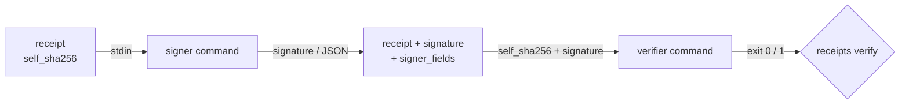

# Evidence & receipts

recurve's promise is *code accompanied by its evidence*. A **receipt** is that
evidence, one verdict at a time: what ran, against which tree, and what it said —
hash-chained per suite so the trail is tamper-evident, and checkable by someone
who was not there.

## The receipt chain

Pass `--receipts` to the gate and recurve appends one receipt per verdict, chained
within each suite:

```bash
recurve matrix --gate --receipts       # emit a receipt per verdict
recurve receipts list                  # show the chain
recurve receipts verify                # re-verify it
```

Each receipt carries its verdict, the probe's hash, the tree identity, a timestamp,
and two fields that make it a chain:

- `self_sha256` — a SHA-256 over the receipt's canonical content.
- `prev` — the `self_sha256` of the previous receipt in the suite (null for the
  first).

Because `self_sha256` is computed over the canonical content, **an edited receipt
fails validation loudly**: change any field and its hash no longer matches; break
the `prev` links and the chain no longer connects. A receipt edited after the fact
cannot pass — that is what "tamper-evident" means here.

```bash
recurve receipts verify
#   ● checkout: 12 receipt(s), chain holds, signatures verify
```

## The pluggable signer

A receipt is a record; a **signature** binds that record to an identity. recurve
defines the receipt and the seam, **never the signature scheme** — you bring the
signer. Configure one command:

```toml
[receipts]
signer = "your-signer-command"
```

For each receipt, recurve pipes the receipt's `self_sha256` to the command on
stdin and stores what it prints as the receipt's countersignature. Any identity
system that can sign a hash works; recurve stays scheme-agnostic.

### The signer may return structured fields

The signer's stdout can be either form:

- an **opaque signature string** (the simple case), or
- a **JSON object** recurve merges onto the receipt.

The JSON form lets a signer record more than a bare signature — for example its own
identifier and a link to a verifiable envelope:

```json
{ "signature": "…", "signer_did": "…", "envelope_ref": "attestations/verdict-….json" }
```

recurve keeps `signature` and records the remaining keys under a reserved
`signer_fields` object. Two rules keep this safe:

- **Add-only.** The signer may add fields; it can never overwrite the receipt's own
  chain or identity fields, so it cannot rewrite history.
- **Excluded from the hash.** The signer runs *after* `self_sha256` is fixed, so
  `signer_fields` (like the signature itself) is left out of the receipt hash. The
  chain still verifies after a signer annotates it.

So a receipt can be self-describing — it records who signed it and where the
re-verifiable envelope lives — without a sidecar file, and without disturbing the
chain.

## The verifier — the dual of the signer

Signing is only half a seam; recurve also re-checks the signatures it stored.
Configure the verifier:

```toml
[receipts]
signer   = "your-signer-command"
verifier = "your-verifier-command"     # the dual of the signer
```

For each signed receipt, `recurve receipts verify` pipes the receipt's
`self_sha256` on stdin and passes the stored signature as an argument; the command
exits `0` if the signature is valid, non-zero if not. So `receipts verify` checks
**both** halves of the evidence: the hash-chain holds **and** every signature is
the expected signer's over the receipt it names. A tampered signature is caught,
not just a broken hash.

With no verifier configured, `receipts verify` checks the chain alone — the
signature check is opt-in, exactly like the signer.



recurve owns the receipt, the chain, and the seam; the identity system owns the
scheme. That boundary is deliberate: it lets any project pin its evidence to
whatever signer it already trusts, offline, with no dependency on recurve knowing
how signatures work.
