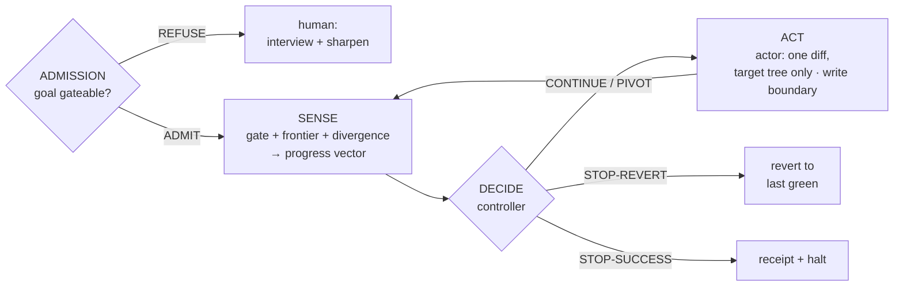

# The verification layer

The everyday loop proves claims GREEN and guards them — **soundness**. But a sound
gate has three blind spots, and the verification layer closes each; a fourth piece
composes them into a loop that can run unattended and decide *for itself* when it
is done.

## Three blind spots a sound gate can't see

- **Admission — is the goal even gateable?** Before a single claim exists, the
  admission gate asks whether a goal can become a faithful contract at all: each
  assertion must be *probe-able* — you can name a check that goes RED if it were
  false. A goal too vague is refused with a per-assertion worklist (an interview),
  never burned down into a brittle proxy. Verdict: `ADMIT` /
  `REFUSE-AND-INTERVIEW` / `REFUSE-NOT-GATEABLE`.
- **Completeness — what does no claim cover?** A sound gate says nothing about the
  surface no claim touches. Surface extraction enumerates a target's claimable
  points; measured coverage records which a probe actually *runs* (traced, not
  declared); the **frontier** is the ranked uncovered remainder. Greenness becomes
  *soundness ∧ completeness* — a cycle is not done while the frontier is nonempty;
  each uncovered point is claimed or explicitly deferred, never silently ignored.
- **Fidelity — did we build the right thing?** A probe can pass while the intent is
  broken. A *goal-counterexample* is a behavior that must never be accepted; if one
  is, the cycle has **diverged**, and no amount of green earns a success-stop.

## Stopping — decided by measurement, not by the worker

A stopping **controller** reads a measured *progress vector* — open / regressed /
broken / uncovered / divergent — and returns exactly one verdict:

`CONTINUE` · `STOP-SUCCESS` · `STOP-REVERT` · `PIVOT`

So *when to stop* is decided by what was measured, never by the agent doing the
work. The burndown loop's success-halt **is** the controller's `STOP-SUCCESS` over
the vector — never an empty backlog and never the cycle cap alone.

## The runtime composes them

The **runtime** wires these into an autonomous burndown loop:

- **Sense** — measure the world into a progress vector (gate + completeness +
  fidelity); never ask the actor how it went.
- **Decide** — the controller returns one verdict from the vector.
- **Act** — a pluggable actor proposes one diff, reached only on an `ADMIT`ted
  contract and kept off the referee surface by a **write boundary** (it may change
  the target tree, never the claims / probes / traps / gate).
- **Revert-to-last-green** — on `STOP-REVERT`, restore the last state the gate
  certified; the actor's damage is rolled back, never shipped.

The verdict is a pure function of what was measured; the actor's self-report is
never an input.

## The principle: deterministic spine, pluggable judgment

One idea runs through the whole layer: **the spine is deterministic, the judgment
is pluggable.** The parts that need an LLM — the rater that reads a goal, the actor
that writes a diff, the adversary that red-teams a claim — sit behind protocols;
everything that *decides* from their output is fixed and itself gated. That is what
lets the loop be trusted rather than believed: it measures instead of trusting
itself, and refuses when it cannot measure.

The loop's **World** and **Actor** are protocols, so it runs on a real target:
a **git-backed World** (checkpoint = commit, revert = reset-to-last-green, the
write boundary enforced on disk against `..`/symlink escapes) and a **BYO-agent
command actor** (an external agent behind a stable seam). The agent stays
external; everything around it is deterministic and gated, including graceful,
*typed* failures when the agent misbehaves or git is unavailable.

A separate adversary periodically red-teams the new claims; anything it finds
becomes a kept **trap** (the capture rule) before the loop trusts it — RED on the
wrong implementation, GREEN on the real one. Each module here is itself guarded by
its own claims suite, hardened the same way the toolkit is.

## On the CLI

Two pieces of the layer are surfaced as verbs; the rest are importable from
`recurvelib.*`:

- **`recurve decide`** (`recurvelib.controller`) — stop / revert / pivot / continue
  from a measured progress vector. The loop asks it every cycle.
- **`recurve frontier`** (`recurvelib.frontier` / `surface` / `measured`) — the
  ranked uncovered surface: what no claim covers, so a green gate can't hide a
  hole. Coverage is what a probe *actually runs* (traced), not what a claim
  declares.
- **Admission** (`recurvelib.admission`), **fidelity** (`recurvelib.fidelity`), and
  **the runtime** (`recurvelib.runtime` + `recurvelib.adapters`) compose the rest.

## Vocabulary

| Term | In the diagram | Meaning |
| --- | --- | --- |
| **Admission** | `ADMISSION` | Is a goal probe-able enough to become a contract? Verdict `ADMIT` / `REFUSE-AND-INTERVIEW` / `REFUSE-NOT-GATEABLE`. |
| **Sense** | `SENSE` | Measure the world into a progress vector — never ask the actor how it went. |
| **Frontier** | `SENSE` (completeness) | The ranked uncovered surface: what no claim covers. |
| **Divergence** | `SENSE` (fidelity) | A goal-counterexample was accepted — the probes pass but the intent broke. |
| **Progress vector** | `SENSE` output | The measured state of a cycle: open / regressed / broken claims, frontier size, divergence. |
| **Controller** | `DECIDE` | Reads the progress vector and returns one verdict: `CONTINUE` / `STOP-SUCCESS` / `STOP-REVERT` / `PIVOT`. |
| **Act** | `ACT` | The actor proposes one diff to the target tree; reached only on an `ADMIT`ted contract. |
| **Write boundary** | `ACT` | The actor may change the target tree but never the referee surface (claims / probes / traps / gate). |
| **Revert-to-last-green** | `STOP-REVERT` | Restore the last state the gate certified green; the actor's damage is rolled back, never shipped. |
| **Interview** | `REFUSE` → human | On a non-ADMIT verdict, the human is asked "what would *wrong* look like?" until each vague assertion has a check — or the goal is declared un-gateable. |
| **Capture rule** | the adversary | An adversary's finding counts only once it is a re-runnable trap — RED on the wrong impl, GREEN on the real. |

For the base loop these sit under and the ceremonies that keep the ledger honest,
see [Architecture](architecture.md).
