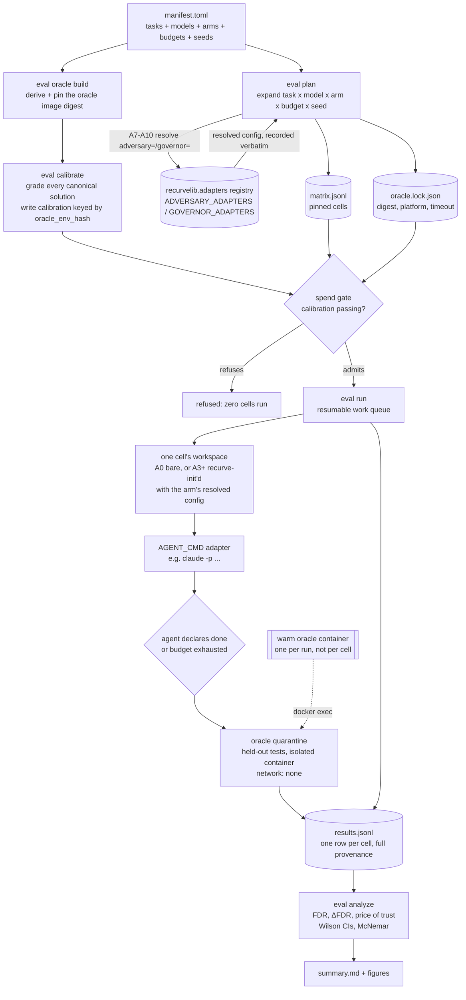

# Evaluation — why, how, and the methodology

recurve's own claim ledger reports footprint: claim counts, one worked wave,
a gate that goes green. That is not the same thing as evidence. The papers
recurve cites as its reference class — AlphaEvolve, λ² — earn their claims
with an external benchmark, an effect size against a baseline, component
ablations, and cost/scaling curves. Until this evaluation program existed,
recurve had never been measured that way.

The one-sentence gap this closes:

> We have never run the same agent, on the same external tasks, with and
> without the gate, and measured **who shipped more bad work**.

Everything in `eval/` exists to produce that number, honestly, and its
ablation decomposition — and to do it while holding the measuring instrument
itself to recurve's own standard: the `eval/` pipeline is a gated recurve
suite (`.recurve/claims/eval`, claims `EV-1`–`EV-24`, all closed), not a
one-off script somebody ran once.

## Architecture

The pipeline is built around one rule: anything that can change a verdict is
pinned before a single paid cell runs, and every cell's provenance — task,
model, arm, resolved gate config, budget — travels with its result row. The
diagram below is the shape that rule produces, from a human-authored
manifest down to the analysis that reads `results.jsonl`:



Three things to notice in that shape:

- **The manifest never talks to the registry directly.** An arm like A7
  (`adversary=cross_model`) or A10 (`adversary=cross_model` +
  `governor=mechanical_review`) is just a name until `eval plan` resolves it
  through the same `recurvelib.adapters` registry that `recurve`'s own
  `[gate]` config uses — so a plan that names an unknown adapter fails at
  `plan` time, not mid-run.
- **The spend gate sits between planning and spending.** `eval calibrate`
  must already show a passing grade of every canonical solution, keyed to
  the exact oracle-environment hash the run will use, or `eval run` refuses
  to start a single paid cell.
- **The oracle never shares a container with the agent.** The agent process
  has already exited (declared done, or hit its budget) before the harness
  hands the solution to the quarantined oracle container, which runs with
  no network access — so a held-out test can never leak into the agent's
  turn, and the harness's own defects only ever bias *toward* more reported
  failures, never fewer (see the reproducibility rule below).

## Why: the quantities that matter

Let a *task* carry a **held-out oracle** — a test the agent never sees. An
*arm* is a configuration (gate components × model × budget). Per task-run,
the agent eventually **declares done** (or exhausts its budget); the harness
then applies the oracle, quarantined in its own environment, after the agent
process has already exited.

- **False-done rate (FDR)** — the headline quantity: `FDR = P(oracle fails |
  arm declared done)`. Compared across arms, `ΔFDR = FDR(no-gate) −
  FDR(gate)` is the effect size the whole program exists to produce.
- **Oracle pass@budget** — `P(oracle passes | token budget ≤ B)`, plotted
  over a budget grid: does the gate's overhead cost outcomes, or buy them?
- **Price of trust** — `tokens(gate arm) / tokens(no-gate arm)` and the
  matching wall-clock ratio, reported next to ΔFDR so the trade is one
  glance, never buried.
- **Gate-rejection rate** — from run records: `Σ attempts − closes`, the
  operational rate at which an agent believes it is done and the gate
  refuses.
- **Interception confusion matrix** (seeded defects) — per gate layer L:
  `TPR_L` (blocks a real defect), `FPR_L` (blocks a known-good change), and
  **marginal detection** `TPR_L − TPR_{L−1}` — what each additional layer
  catches that the previous stack missed.
- **Miss-correlation ρ** — over seeded defects graded by both an actor
  configuration and an adversary configuration: `ρ = P(adversary misses |
  actor missed) / P(adversary misses)`. `ρ ≈ 1` means independent failures;
  `ρ ≫ 1` means the actor and its checker share a blind spot. This is the
  quantity the internal `oracle-strength-and-decorrelation` and
  `ablation-infra` design docs (`docs/plans/`) give a concrete, gated engine
  mechanism to — see [Results](results.md) for the live incident that
  motivated them.

Statistics throughout: paired design (same tasks, every arm), McNemar's test
on paired pass/fail deltas, Wilson 95% intervals on every rate, raw fractions
always shown alongside a percentage — never a bare two-significant-figure
number on single-digit n.

## How: the arm ladder, not a factorial

Every ablation is a **configuration** of the same engine — a `recurve.toml`
+ flags — never a fork of the CLI, so an arm is fully reproducible from its
own results row (the resolved `[gate]` config is recorded verbatim, not just
an arm label). The full cross product of every switch runs into the
hundreds of arms and is deliberately not attempted; instead the matrix is a
**ladder plus leave-one-out**, extended (not replaced) as new switches are
built:

```
A0  no-recurve                       — agent + task, declares done itself (the control)
A1  plain-CI                         — agent + the repo's own test suite as CI gate
A2  recurve, traps off               — claims + probes, RED-first disabled
A3  recurve full                     — claims + probes + traps (default discipline)
A4  A3 + fuzz/iso/diff               — hardened probes
A5  A3, write boundary off           — what the write boundary is worth
A6  A3, controller off               — what external stopping is worth
A7  A3 + adversary=cross_model       — per-claim decorrelation alone
A8  A3 + governor=mechanical         — free run-level re-execution check alone
A9  A3 + governor=mechanical_review  — run-level decorrelated review alone
A10 A3 + adversary=cross_model
       + governor=mechanical_review  — the full decorrelation stack
```

A0→A3 is the effect-size story; A2/A5/A6 vs A3 attribute value to each
component; A4 measures the hardening margin; A7–A10 measure the marginal
value of per-claim adversary review vs. run-level governor review vs. both
together. The POC scope is `{A0, A3}` only — A7–A10 are the ablation-phase
arms, gated on the adapters `ablation-infra.md` built.

## The reproducibility design rule

> Anything that can change a verdict must be pinned and refused-on-drift.
> Anything that can change a timing must be recorded. The manifest is human
> intent; the lock is machine-resolved truth.

Three things can silently change a number; each is pinned and recorded:

| Citizen | Intent (the manifest) | Resolution (locked at plan time) | Refuses on drift |
|---|---|---|---|
| Dataset | `[tasks]` benchmark + revision | local JSONL + content hash + count | a hash/count mismatch is rejected |
| Model | `[matrix]` models | frozen into `matrix.jsonl` before any run | cell ids derive from coordinates |
| Oracle env | `[oracle.env]` mode + image + digest | `oracle.lock.json` (image **digest**, platform, container Python, wrapper hash, resolved timeout, exclusion-table hash) | a digest mismatch, or a bare mutable `:tag`, is refused outright |

Every harness defect in this design fails in **one direction**: a correct
real solution turning into an error reads as an oracle failure, which
inflates shipped-bad-work — the paper's own headline. A broken harness
silently *confirms* the thesis rather than contradicting it, which is why
the rule is strict, and why a **calibration gate** stands before any paid
run: all canonical solutions are graded through the finished oracle path
first, keyed to the oracle-env hash, and no paid cell runs while that pass
rate is red.

## Scope and limitations: what these tasks can and cannot tell us

**The current and planned numbers are about short, bounded, single-shot
coding tasks — not about the long-running, multi-file planning work recurve
is actually built for.** This is worth stating plainly rather than letting
a reader over-read an FDR number.

A BigCodeBench-Hard task is one Python function, written against one hidden
`unittest` file, at a 60,000-token budget (O6's actual cap) — the kind of
thing a competent model finishes in one shot in a few minutes. That shape
was chosen for the POC *on purpose*, for reasons already on record before
this evaluation program existed: HumanEval+/MBPP+ is too easy to leave
headroom for a delta to show up, and SWE-bench Lite/Verified — "the most
credible substrate" — was explicitly deferred to a later phase because
"docker-image-per-task, long trajectories, and a weak model in a large
repo" make it slow, expensive, and noisy as a *first* run. In other words:
the current benchmark is a deliberately cheap, fast, low-noise way to
bootstrap the harness — not a claim that it represents recurve's real
workload.

Contrast that with the task that actually produced `ablation-infra.md` and
`oracle-strength-and-decorrelation.md` in the first place: dozens of files
across a new ports/adapters package, a run-level governor, a unified
challenge-event log, threaded through one continuous multi-hour session,
where a mistake made early (forgetting a constraint, quietly breaking a
claim that was already green while closing a later one) is only visible
much later, if at all. Almost none of recurve's actual value proposition —
catching drift, cross-file inconsistency, or a stale claim that silently
regressed — has room to occur inside a single 60k-token, single-function
task. A model either gets the one function right or it doesn't; there is
no "forgot something from three hours ago" failure mode to catch.

That cuts against the eval program in a specific, correctable way: a small
measured ΔFDR on BigCodeBench-Hard would **not** be evidence that the gate
doesn't help — it could equally mean the task is too short for the failure
mode the gate targets to ever occur. The reverse also doesn't transfer
automatically: a large ΔFDR on short tasks is not proof of the same effect
size on long-horizon work. Neither direction can be assumed; each is its
own measurement.

What's already scoped to narrow this gap, and what isn't:

- **Scoped, not yet run** — SWE-bench Verified (`eval-full.md`'s E2): real
  GitHub issues against real multi-file repos, graded by the repo's own
  `FAIL_TO_PASS`/`PASS_TO_PASS` tests. Real repo scale, real defects, a
  trusted oracle — a genuine step up in realism. Still bounded to a single
  issue's fix, typically well under an hour of agent time — closer to the
  toy-task end of the spectrum than to a from-scratch, multi-day PRD build.
- **Not scoped anywhere yet** — a task tier at the actual scale of recurve's
  own workload: "implement this PRD end-to-end, under the gate vs. not."
  Recurve's own dogfooding history (this very PRD pair, or any prior one)
  is the natural source of such instances, but it has a real methodological
  problem that has to be solved before it can be built, not glossed over:
  recurve's claims ledger can't grade its own claims-ledger-gated run
  without circularity. A credible oracle here would need something
  independent of the mechanism under test — e.g., a held-out subset of a
  PRD's acceptance criteria never shown to the agent (mirroring
  BigCodeBench's hidden-test pattern, at PRD scale), or a blind rubric
  judgment against the PRD's literal text. No such design exists yet; this
  is an open question, not a built capability.

## Where to go next

- **[Running the evals](running.md)** — the exact commands, in order, to
  reproduce any run in this repo (or plan a new one) from a clean clone.
- **[Results](results.md)** — what has actually been run so far, the real
  numbers, and the one incident (O6) that already came out of this
  pipeline and reshaped the engine itself.
