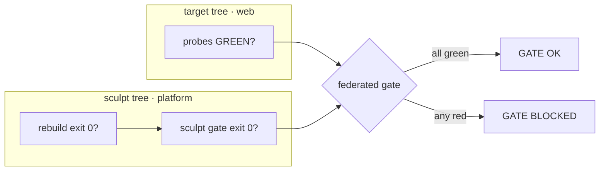

# Multi-repo: build one tree, sculpt another

Some loops live in two repos: a **scaffold** you build — a frontend, a demo, a
conformance suite — that *exercises* a **platform** in another repo, where the
honest fix for a gap the scaffold reveals is to harden the platform.

To give an analogy: you have a car with a working engine, but you need to rebuild
the transmission. You rebuild the transmission, then check that it integrates and
works with the engine. If you find an issue in the transmission, the working
engine is your feedback loop — it tells you what "correct" looks like while you
work. Multi-repo loops work the same way: the scaffold is the transmission under
test, the platform is the engine it must integrate with, and the gate is the
integration check.

recurve models this directly. A config declares one primary `[target]` (the tree
the loop **builds**) plus zero or more `[sculpts.<name>]` (secondary trees, in
other repos, the loop may **sculpt** when a claim's honest fix lives there):

```toml
[target]                                  # the PRIMARY tree the loop BUILDS
tree = "web"
forbidden_strings = ["GAP-", "FE-"]
rebuild = "npm ci && npm run build"

[sculpts.platform]                        # a SECONDARY tree in another repo
tree = "../platform"
branch = "dev-platform"                   # its commits land on this branch
forbidden_strings = ["GAP-"]              # its OWN leak vocabulary
rebuild = "cargo build --release"         # turn its source into what probes read
gate = "cargo test"                       # its OWN gate, federated into ours
```

**`[target]` is what you build; `[sculpts.*]` is what you feed.** When a claim's
honest fix is in a sculpt tree, the cycle sculpts there and commits to that repo
on its declared `branch` — one commit per repo touched, never a cross-tree change
in one commit.

## Per-sculpt fields

| Field | Meaning |
| --- | --- |
| `tree` | Path to the secondary repo's working tree (usually a sibling, e.g. `../platform`). |
| `branch` | The branch a sculpt commit lands on, so its history stays separate from the target's. |
| `rebuild` | The command that turns the sculpt's source into the artifact the probes read. Run before probing (see below). |
| `gate` | The sculpt's **own** gate command. Its exit code is folded into the federated gate; empty means no gate. |
| `forbidden_strings` | Vocabulary that must never leak into *this* tree. Each tree carries its own list, so loop-internal names stay out of every product the loop touches. |

## The gate rebuilds each sculpt first

A claim whose fix lives in a sculpt is only honest if the gate measures the
sculpt's **current source**, not a stale prebuilt artifact. So in gate mode,
`recurve matrix --gate` runs each sculpt's `rebuild` command in its own tree
**before** probing:

```bash
recurve matrix --gate
#   sculpt platform: rebuild OK (exit 0)
#   ● … probes run against the freshly rebuilt platform …
```

A failing rebuild fails the gate — a sculpt that no longer compiles can't quietly
pass. With no `[sculpts.*]` tables this step is a no-op, so single-tree behavior
is unchanged.

## The federated gate

The gate **federates**: `recurve matrix --gate` is green only when the target's
probes pass **and** every declared sculpt's own `gate` command exits zero. A
sculpt that breaks the platform's gate turns the federated gate red even if the
scaffold's own probes are green — so a scaffold can never "pass" by hardening
itself while regressing the platform it feeds.



## Single-tree is the default

With no `[sculpts.*]` tables, a config is exactly single-tree: no rebuild step, no
federation, nothing to configure. Multi-repo is opt-in and costs nothing until you
declare a sculpt.
