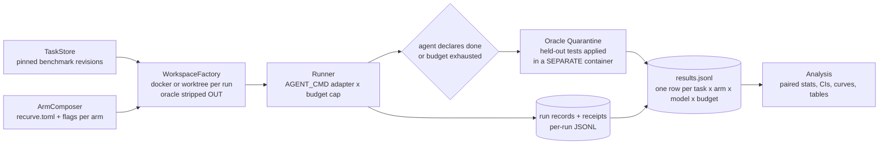

# Evaluation architecture — measuring recurve the way the papers we cite measure themselves

> Purpose: AlphaEvolve and λ² earn their claims with external benchmarks,
> effect sizes against baselines, component ablations, and cost/scaling
> curves. recurve currently reports footprint (claim counts, one worked
> wave). This document is the architecture for closing that gap: **what is
> missing, what we measure, how the pipeline is built, where the benchmarks
> come from, and what has to change in recurve itself** (very little — the
> BYO-agent seam already makes the pipeline provider-agnostic; the ablations
> are config switches, most of which exist).
>
> Everything here is buildable as gated claim waves — the evaluation harness
> is itself a recurve target, so the instrument that measures the framework
> is held to the framework's own standard.
>
> **Start with the POC.** The first concrete step of this program — Haiku
> 4.5 + Sonnet 5, 0% vs 100% recurve, BigCodeBench-Hard, including the
> `eval/` pipeline that must be built first — is specified separately and
> self-contained in [eval-poc.md](eval-poc.md). Everything below is the
> program the POC bootstraps.

---

## 1 · What is missing, exactly

Mapping the four dimensions of the reference papers onto recurve:

| Dimension | What they have | What we're missing | What fills it (this doc) |
|---|---|---|---|
| External benchmark | AlphaEvolve: 50+ open problems, prod systems. λ²: 40+ synthesis tasks | Any task set not authored by us | §3: SWE-bench Verified, Defects4J/BugsInPy, HumanEval+/MBPP+, LiveCodeBench, miniF2F/PutnamBench |
| Effect size vs baseline | improved/matched counts; % solved vs prior tools | A control arm: the same agent *without* the gate | the POC ([eval-poc.md](eval-poc.md)) + §4 arms: gate-off, plain-CI, gate-on; headline = **false-done rate delta** |
| Ablations | evolution off / context off / model size | Component-off switches wired into an arm matrix | §4: the ablation switch inventory (5 exist, 3 to build) |
| Scaling / cost curves | compute budget vs quality | Budget-capped runs + token/wall-clock telemetry per arm | §6: budget grid × pass-rate curves; price-of-trust |

The one-sentence gap: **we have never run the same agent, on the same
external tasks, with and without the gate, and measured who shipped more bad
work.** Everything below exists to produce that number and its ablation
decomposition, credibly.

## 2 · The quantities we measure (definitions first)

Let a *task* have a **held-out oracle** O (tests the agent never sees). An
*arm* is a configuration (gate components × model × budget). Per task-run,
the agent eventually **declares done** (or exhausts budget); the harness then
applies O.

**Primary metrics**

- **False-done rate (FDR)** — the self-deception rate, the paper's central
  quantity: `FDR = P(O fails | arm declared done)`. Compared across arms:
  `ΔFDR = FDR(no-gate) − FDR(gate)` is the headline effect size.
- **Oracle pass@budget** — `P(O passes | token budget ≤ B)`, plotted over a
  budget grid → the scaling/cost curve (gate arms pay overhead; the question
  is whether verified-pass at matched budget still dominates).
- **Interception confusion matrix** (M1, seeded defects): for each gate
  layer L: `TPR_L = P(gate blocks | seeded defect)`,
  `FPR_L = P(gate blocks | known-good change)`, and **marginal detection**
  `TPR_L − TPR_{L−1}` — what each layer catches that the previous stack
  missed. This is the component-attribution table.
- **Price of trust** — `tokens(gate arm) / tokens(no-gate arm)` and
  wall-clock ratio at matched task set; reported next to ΔFDR so the trade
  is one glance.
- **Gate-rejection (calibration) rate** — from run records:
  `rejections = Σ attempts − closes`; the operational rate at which agents
  submit work they believe done and the gate refuses.
- **Miss-correlation (decorrelation residue)** — over seeded defects
  evaluated by both an actor-config and an adversary-config:
  `ρ = P(adversary misses | actor missed) / P(adversary misses)`; ρ≈1 means
  independent, ρ≫1 means correlated failures. Run same-model vs cross-model.

**Statistics.** Same tasks across all arms (paired design). Pass/fail deltas:
McNemar's test; rates carry Wilson 95% intervals; n ≥ 50 per cell for the
headline claims, n ≥ 20 for ablation cells (report CIs regardless; never a
bare two-significant-figure percentage on single-digit n). Every run pinned:
model version string, recurve commit, task revision, seed.

## 3 · Benchmark substrate — where tasks and oracles come from

Two properties qualify a benchmark here: (a) a **machine-checkable held-out
oracle**, (b) tasks we didn't author. All locations below verified online
2026-07-04. Sources, by role:

| Benchmark | Exact location (verified) | Size | Held-out oracle | Role here | Cost/run |
|---|---|---|---|---|---|
| **BigCodeBench-Hard** | HF: <https://huggingface.co/datasets/bigcode/bigcodebench-hard> · harness: <https://github.com/bigcode-project/bigcodebench> (`pip install bigcodebench`) | 148 tasks | hidden `unittest` suite per task (`test` field) | **The POC substrate ([eval-poc.md](eval-poc.md))** | Low–Med |
| BigCodeBench (full) | HF: <https://huggingface.co/datasets/bigcode/bigcodebench> (v0.1.4, 1,140 tasks) | ~1.1k | same | mid-tier realism between EvalPlus and SWE-bench | Med |
| **SWE-bench Verified** | HF: <https://huggingface.co/datasets/princeton-nlp/SWE-bench_Verified> (also mirrored at `SWE-bench/SWE-bench_Verified`) · harness: <https://github.com/SWE-bench/SWE-bench> (`pip install swebench`; docker eval via `swebench.harness.run_evaluation`) · docs: <https://www.swebench.com> | 500 human-validated real GitHub issues | FAIL_TO_PASS + PASS_TO_PASS tests in official docker images | **The flagship A/B substrate** (E2): real repos, real defects, trusted oracle | High |
| SWE-bench Lite | HF: <https://huggingface.co/datasets/princeton-nlp/SWE-bench_Lite> | 300 | same | cheaper pilot of the same design | Med |
| **HumanEval+ / MBPP+** | HF: <https://huggingface.co/datasets/evalplus/humanevalplus> / <https://huggingface.co/datasets/evalplus/mbppplus> · harness: <https://github.com/evalplus/evalplus> (`pip install evalplus`) | 164 / 378 fn-level | extended hidden test suites (80×/35× the originals) | **Smoke tier**: cheap pipeline validation; NOT headline material (contaminated, near-ceiling) | Low |
| **LiveCodeBench** | HF: <https://huggingface.co/datasets/livecodebench/code_generation_lite> (versioned: `release_v1`…`v6+`, use post-cutoff releases) · repo: <https://github.com/LiveCodeBench/LiveCodeBench> | rolling (600+ problems) | hidden stdin/stdout tests, post-cutoff problems | **contamination sensitivity arm**: if effects vanish on post-cutoff tasks, contamination was doing the work | Med |
| **Defects4J** | github: <https://github.com/rjust/defects4j> | 854 real Java bugs | dev-written failing→passing triggering tests | **E1 with *real* defects**: interception on human bugs, not synthetic mutants | Med |
| BugsInPy | github: <https://github.com/soarsmu/BugsInPy> | ~500 real Python bugs | same pattern | Python twin of Defects4J; closer to our tooling | Med |
| Aider polyglot | github: <https://github.com/Aider-AI/polyglot-benchmark> · runner: <https://github.com/Aider-AI/aider/blob/main/benchmark/README.md> | 225 Exercism problems, 6 languages | per-exercise unit tests | multi-language breadth arm (C++/Go/Java/JS/Py/Rust) | Med |
| mutmut / cosmic-ray | PyPI: <https://pypi.org/project/mutmut/> / <https://pypi.org/project/cosmic-ray/> | unbounded | mutants are known-bad by construction | **E1 synthetic tier**: seeded defects at volume, per-layer ablations | Low |
| **miniF2F** | Lean 4 port: <https://github.com/yangky11/miniF2F-lean4> (LeanDojo; lightly maintained — pin a commit) · original (Lean 3 era): <https://github.com/openai/miniF2F> | 488 olympiad statements | the Lean kernel | **strong-oracle track**: the oracle-spectrum thesis measured at its strong end | Med |
| PutnamBench | github: <https://github.com/trishullab/PutnamBench> | Putnam 1962–2025; 1,724 formalizations across Lean 4/Isabelle/Coq | proof-assistant kernels | harder strong-oracle tier | High |

Notes: exact HF dataset revisions get **pinned by a probe** (the loader
claim asserts a specific dataset revision hash — benchmarks are evidence, so
they're version-pinned like everything else; LiveCodeBench additionally pins
a `release_v*` tag). GitHub corpora (Defects4J, BugsInPy, miniF2F-lean4,
PutnamBench, polyglot-benchmark) are cloned at pinned commits.

## 4 · Ablation design — what we switch off, and what that requires

The reviewers' question "do we ablate CLI components?" — yes, but **never by
editing the CLI**: every ablation is a *configuration* of the same engine, so
an arm is a `recurve.toml` + flags, reproducible from the results row.

**The switch inventory:**

| Layer / mechanism | Switch | Status |
|---|---|---|
| Traps (RED-first enforcement) | `[gate] traps = "off"` | **exists** |
| Fuzz pass | `drill --fuzz` + `[drill] fuzz_n/fuzz_fpr_max` | **exists** |
| Iso pass | `drill --iso` + knobs | **exists** |
| Differential (reference oracles) | `drill --diff` + per-claim `reference:` | **exists** |
| Oracle waivers | `oracle_waiver` per claim | **exists** |
| Discovery search (backlog refill) | `[fansearch] proxy = "off"` (default) vs a registered domain | **exists** |
| Probes at all (gate → plain agent) | omit recurve entirely (control arm) | trivial |
| **Write boundary off** (agent may edit probes) | needs a flag on the runtime World boundary | **to build** (one config knob; the boundary lives in `adapters.py`) |
| **Fresh-agent-per-cycle off** (one long-context agent instead) | needs a burndown-runner mode | **to build** (harness-level, not engine) |
| **Controller off** (stop when the agent says done) | needs a runner mode that trusts the run-record's own summary | **to build** (harness-level) |

The three to-build switches are deliberately **harness-or-flag level**, not
engine forks — each is a gateable claim ("with `boundary = off` the agent can
modify probe files and the gate records that the run was unprotected"), and
each ships with a trap.

**The arm matrix** (headline experiment):

```
arms = {
  A0  no-recurve                       — agent + task, declares done itself (control)
  A1  plain-CI                         — agent + repo's own test suite as CI gate, no claims/traps
  A2  recurve, traps off               — claims + probes, RED-first disabled
  A3  recurve full                     — claims + probes + traps (default discipline)
  A4  A3 + fuzz/iso/diff               — hardened probes
  A5  A3, boundary off                 — measures what the write boundary is worth
  A6  A3, controller off               — measures what external stopping is worth
  A7  A3 + adversary=cross_model       — per-claim decorrelation alone
  A8  A3 + governor=mechanical         — free run-level re-execution check alone
  A9  A3 + governor=mechanical_review  — run-level decorrelated review alone
  A10 A3 + adversary=cross_model
        + governor=mechanical_review  — full decorrelation stack (A7 + A9)
  A11 A3 + fansearch=<domain>          — backlog refilled by discovery search, not a human/PRD
}
```

A0→A3 is the effect-size story; A2/A5/A6 vs A3 are the component
attributions; A4 measures the hardening margin; A7–A10 (defined in
`oracle-strength-and-decorrelation.md` §3a) measure the marginal value of
per-claim adversary review vs. run-level governor review vs. both
together — a ladder-plus-leave-one-out design, not a full factorial
(the full cross product of every switch here runs into the hundreds of
arms and is deliberately not attempted). Every arm's resolved `[gate]`
config is recorded verbatim in its results rows, not just the arm label.
Not every benchmark runs every arm (cost §7). The POC runs {A0, A3} only;
A7–A10 are E4/ablation-phase arms.

A11 is a different kind of comparison from A0–A10: those all ask "how
much does a gate component matter, holding the backlog fixed"; A11 asks
whether the backlog *itself* needs a human/PRD author at all, at
identical gate discipline (A3's claims + probes + traps, unchanged) —
does `recurve fansearch run --domain <name>` refill an exhausted backlog
with claims that close at a comparable rate to hand-authored ones, or
does it mostly produce candidates that gate-reject or duplicate what a
human would have written anyway. `[fansearch] proxy = "off"` (the
default) is A3 exactly — the switch's inertness is itself a gated claim
(`FS-9`, `recurve`'s own suite), not an assumption: turning fansearch on
must be the only thing that changes between A3 and A11's `recurve.toml`.

## 5 · Provider-agnostic model matrix — what's actually needed

Short answer to "do we need new ports/adapters architecture?": **no — the
seam already exists.** recurve's loop contract is: *an agent is any command
that reads a cycle prompt on stdin and writes a run-record to
`$RECURVE_RESULT_FILE`* (`$AGENT_CMD` / `recurve run --agent`). Providers
plug in as thin adapter scripts; the engine never learns who it's talking to.

What each provider needs is a ~50-line wrapper conforming to that contract:

| Provider/model | Adapter | Notes |
|---|---|---|
| Anthropic (Fable, Opus 4.8, Sonnet) | `claude -p --bare --permission-mode bypassPermissions` | exists today; `--bare` avoids hook interference |
| OpenAI (GPT-5.x, codex-style) | codex CLI if available, else a driver script (API: prompt in, tool-use loop, patch out) | driver script ~1 day |
| Google (Gemini) | gemini CLI or driver script | same shape |
| Open models (Qwen-coder, DeepSeek) | vllm/ollama + the same driver script | driver is shared; only the endpoint differs |

**What IS missing** (small, real): a **telemetry normalization layer** — the
run-record schema already has a `tokens` object; the adapters must populate
it uniformly (prompt/completion/total + provider list price → cost). One
shared `eval/evallib/adapters/telemetry.py` + a per-provider price table,
pinned by date. Plus per-adapter: version pinning (model string recorded verbatim),
timeout policy, and a retry contract (retries count as attempts — they're
part of the cost story, never silently absorbed).

## 6 · Pipeline architecture



Components (each a claim in the `eval` suite):

1. **TaskStore** — downloads + pins benchmark instances (HF `datasets` /
   git clones at fixed revisions); materializes a task as `(repo state,
   task statement, oracle bundle)`. The oracle bundle is stored *outside*
   the workspace from the start.
2. **WorkspaceFactory** — one isolated workspace per (task, arm, model,
   budget, seed): docker for SWE-bench (their official images), git
   worktrees + venvs for lighter tiers. **The workspace never contains the
   held-out oracle** — this is the load-bearing isolation. For gate arms it
   also stamps the arm's `recurve.toml`.
3. **ArmComposer** — the ablation matrix → concrete configs (§4). Pure
   function; the arm identifier in every results row reproduces the config.
4. **Runner** — launches the provider adapter under a token/wall-clock
   budget; for recurve arms the agent works the claim loop (it authors
   claims/probes from the task statement — which also exercises §7.4
   automated-authoring honestly); for control arms it just works the task.
   Emits run-records + receipts.
5. **Oracle Quarantine** — after the run *ends*, a separate container mounts
   the final workspace read-only, injects the held-out tests, runs them, and
   emits the oracle verdict. The agent process is dead before the oracle
   exists anywhere near the workspace. (Threat: oracle leakage via model
   memorization of the benchmark — that's the LiveCodeBench sensitivity arm,
   not something quarantine can fix.)
6. **ResultsStore** — one JSONL row per run:
   `{task, benchmark_rev, arm, model, model_version, budget, seed,
   declared_done, oracle_pass, gate_verdicts, attempts, rejections,
   tokens{...}, cost_usd, wall_s, recurve_commit, receipts[...]}` —
   deterministic, diffable, and **exportable through `recurve trajectories`**
   so the evaluation corpus is itself provenance-gated.
7. **Analysis** — a small, boring, pinned script set (not notebooks-as-truth):
   paired McNemar tables, Wilson CIs, `pass@budget` curves, the confusion
   matrix table, price-of-trust table. Every figure in the paper regenerates
   from `results.jsonl` by one command.

**Where it lives:** `eval/` at the repo root — its own uv project
(`eval/pyproject.toml` with `datasets`, `docker` SDK etc.); the engine's
stdlib+PyYAML posture is untouched because `recurvelib` never imports it.
The exact layout (evallib modules, `experiments/` manifests, immutable
`runs/` dirs, the plan → run → analyze verbs, reproducibility rules) is
specified in [eval-poc.md §5](eval-poc.md) and gets built for the POC.
The pipeline is a recurve *target* (the `eval` suite in the ledger):
TaskStore pinning, quarantine isolation, resume correctness, telemetry
normalization, and analysis determinism are all claims with traps. The
generalizations this section adds over the POC pipeline are incremental:
docker workspaces for SWE-bench, more adapters, more arms — same
manifest → matrix → results → analysis spine.

## 7 · Experimental designs, per metric family

**E1 — Interception (M1): synthetic + real defects.**
Substrate: BugsInPy (real) + mutmut mutants (volume) over 3–5 pinned Python
repos with recurve suites authored once (by us, gated). For each defect:
apply, run gate per layer-arm (A2→A4), record block/pass. Output: the
per-layer confusion matrix + marginal detection + trap-count and fuzz_n
efficacy curves. No LLM in the loop → cheap, high-volume, fully
reproducible. *This is the first table the paper gains.*

**E2 — The A/B (M2): false-done rate under held-out oracles.**
Substrate: SWE-bench Verified subset (start n=50 stratified by difficulty;
scale to 200+ for the venue version) × arms {A0, A1, A3} × models {Sonnet,
GPT-5.x-equivalent, one open model} × one budget tier. Headline: ΔFDR and
oracle-pass@budget with CIs; secondary: gate-rejection rate, price of trust.
Pilot on SWE-bench Lite n=20 first to burn in the pipeline.

**E3 — Scaling/cost curves.** E2's A0 vs A3 rerun across a budget grid
(e.g. 200k/500k/1M/2M tokens) on a fixed n=30 subset → `pass@budget` and
`verified-pass@budget` curves. The question the curve answers: does the
gate's overhead ever stop paying for itself as budget grows?

**E4 — Model matrix.** E2's A3 arm across the provider matrix — the
framework's value *as a function of the agent's strength*. The POC's
Haiku-vs-Sonnet cells are the first two points; the honest hypothesis test:
is the gate's ΔFDR *largest* for weaker/cheaper models (the economic
argument for gate+cheap-model vs bare+frontier-model), or does it peak
mid-tier because weak models can't operate the harness?

**E5 — Decorrelation (the §2.9 residue).** Over E1's defect corpus: actor
authors a fix, adversary reviews via the capture rule; measure
miss-correlation ρ for same-model vs cross-model actor/adversary pairs.
Concretely, this is arms A7/A8/A9/A10 vs A3 (`oracle-strength-and-
decorrelation.md` §3a): A7 isolates per-claim adversary review, A8/A9
isolate the run-level governor's mechanical and review tiers, A10 is
both combined — giving marginal detection per decorrelation mechanism,
not just "decorrelation helps or it doesn't."

**E6 — Strong-oracle track.** miniF2F subset with Lean-kernel probes (the
navier-style probe engine generalizes): the same A0-vs-A3 design where the
oracle is sound — measures the oracle-spectrum thesis instead of assuming
it (prediction: FDR(A0) is *high* even here — models claim proofs they
don't have — but gate FPR≈0, so ΔFDR is nearly pure gain).

## 8 · Threats to validity (and the mitigation built into the design)

- **Oracle leakage into the workspace** → quarantine architecture (§6.5);
  plus a trap: a planted workspace containing the oracle must be refused.
- **Benchmark contamination** (models memorized SWE-bench) → LiveCodeBench
  sensitivity arm; report headline effects on both; if the effect only
  exists on pre-cutoff tasks, say so.
- **Flaky oracles** → SWE-bench *Verified* exists precisely for this; for
  BugsInPy, 3× oracle re-runs, majority verdict, flake rate reported.
- **Arm cross-talk** (agent in A0 benefiting from recurve artifacts) →
  fresh workspace per run; arms never share state.
- **Cherry-picked tasks** → task subsets selected by pinned seed, published
  in results.jsonl before runs (registered-report style).
- **Our own bias** — the harness is recurve-gated, and the analysis scripts
  are deterministic and re-runnable from published results.jsonl: the same
  "reproduce our numbers without trusting us" affordance the paper needs.

## 9 · Phasing, cost, and what each phase feeds the paper

| Phase | Builds | Cost (rough) | Paper payoff |
|---|---|---|---|
| P0 (days) | **the POC ([eval-poc.md](eval-poc.md))**: the `eval/` pipeline built + its claims GREEN first, then BigCodeBench-Hard × {Haiku, Sonnet}, A0 vs A3 | ~$100–300 API | pipeline exists + **first ΔFDR numbers + model×gate interaction**; §5 gains "the harness" |
| P1 (days–week) | E1 interception: BugsInPy + mutmut, layer arms A2–A4 | CPU only | **the confusion-matrix + ablation table** — the single biggest metrics upgrade |
| P2 (week+) | E2 pilot (Lite n=20) then Verified n=50, 3 arms × 2–3 models; E3 budget grid on subset | ~$1–5k API | **ΔFDR headline + price-of-trust + scaling curve** |
| P3 (opportunistic) | E4 model matrix, E5 decorrelation, LiveCodeBench sensitivity | ~$1–3k | ablations complete; residue #3 measured |
| P4 (later) | E6 strong-oracle track (miniF2F) | Lean infra reuse | oracle-spectrum thesis measured, not asserted |

Everything through P1 has **no meaningful API cost** and already produces
the table that answers "your metrics aren't that great." P2 is where money
meets the headline number.

## 10 · Build plan / PRD-ization

This document decomposes into two PRDs, both admissible in the usual form:

- **PRD-EVAL-1 (P0+P1):** the `eval/` pipeline ([eval-poc.md §5](eval-poc.md)
  layout: evallib, experiments/, runs/, the five claims) + the three
  to-build ablation switches (boundary-off flag, single-context runner mode,
  controller-off runner mode — each engine/harness knob a claim with a trap)
  + E1 end-to-end with the confusion-matrix table as a generated artifact.
  Mostly CPU; the POC run itself is the exit criterion.
- **PRD-EVAL-2 (P2+):** provider adapters (OpenAI/Gemini/open-model drivers
  + telemetry normalization), SWE-bench workspace factory (docker), E2/E3
  runs, analysis tables. Gateable except the spend itself, which is a budget
  decision (knob, not policy: `--budget` caps per arm).

First concrete steps if green-lit: write PRD-EVAL-1, `recurve admit` it,
author the `eval` suite claims RED-first, and let the loop build its own
measuring instrument.
