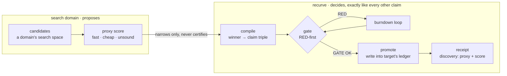

# fansearch: fan-out discovery search

Everything else in this guide assumes you already know what to claim. **fansearch**
is for the step before that: when the *proposition itself* is unknown, and the
honest work is searching a space of candidates for one worth proposing. It's an
optional, pluggable front end to the same gate — named as an explicit homage to
DeepMind's [FunSearch](https://www.nature.com/articles/s41586-023-06924-6), which
established the pattern being reused here: an evolutionary search proposes
candidates, a fast evaluator scores and selects among them, and only the
evaluator's surviving output is kept.

Read against the rest of recurve's model: the evaluator is a **proxy**, not a
referee. A proxy is cheap, approximate, and explicitly *unsound* — it may rank or
filter candidates, but it never certifies. The only route from a proxy-favored
candidate to a closed claim is the one every other claim takes: compile it into a
genuine proposition–probe–trap triple, baseline it RED-first, and let the real
gate decide.

## When to use it

fansearch is a good fit when:

- there's a large (or infinite) space of candidate objects — parameters, weights,
  small expressions, configurations — you want to search over;
- you can write a **cheap, approximate scoring function** over a candidate,
  even though it isn't authoritative (a proxy — fast, not sound); and
- you have a **target** with its own strong, independent gate that can verify
  whether one specific candidate is actually correct.

It's the wrong tool when you already know the exact claim to make (just author
it — see [Usage](usage-provider-agnostic.md)), or when there's no cheap way to
score a candidate ahead of the real, expensive verification — without proxy
signal to search on, "search" is just random sampling with extra steps.

fansearch is **off by default** (`[fansearch] proxy = "off"`). Turning it on is a
deliberate, per-project choice, and it costs nothing while off — the core loop
holds no reference to it at all.

## Architecture

A **domain adapter** contributes the parts that are specific to what you're
searching: a candidate space, a proxy score over it, and a *compile* step that
turns a proxy-favored candidate into an ordinary claim. A **target** contributes
the parts that are specific to where a discovered claim gets checked and lands:
how to verify a compiled candidate for real, and how to write it into that
project's own ledger. Neither side needs to know the other's specifics — the same
"bring your own agent" separation the core loop already uses for the working
agent, generalized to "bring your own search domain" and "bring your own target."



Walking the diagram:

1. **Candidates.** The domain's search space — whatever "a candidate" means for
   the problem at hand.
2. **Proxy score.** A fast, cheap, unsound signal that ranks candidates. It never
   decides anything on its own — it only narrows what gets attention.
3. **Compile.** The winning candidate becomes an ordinary claim: a proposition, a
   probe, and a trap, exactly like one a human would author by hand.
4. **Gate.** The compiled claim is baselined RED-first and burned down through the
   same gate as every other claim in the ledger — no shortcut for a discovered
   claim relative to a hand-authored one.
5. **Promote.** The one irreversible step, and it's explicit and manual: a
   GATE-OK candidate is written into the target's own ledger, and verified there
   by the target's **own**, independently-run gate — not recurve's opinion of it.
6. **Receipt.** The target's own receipt records which proxy and what score
   proposed the claim — provenance that follows a discovered claim forever,
   without changing how it's verified relative to a hand-authored one.

## Trying it

```bash
# search a registered domain, scoring candidates against your target's gate
recurve fansearch run <domain> --ns-repo <path-to-target> --budget 300 --dry-generations 5

# what's been found so far
recurve fansearch status
recurve fansearch archive <domain>

# land a specific, already gate-confirmed candidate for real (the one
# irreversible step — always explicit, never automatic)
recurve fansearch promote <domain> <round> --claim-id <id> --ns-repo <path-to-target>

# audit the proxy itself: does it actually discriminate known-good from known-bad?
recurve drill --fansearch
```

`run` proposes, scores, and read-only verifies new records against the target's
real gate (via a scratch check — nothing is written yet). `promote` is a
separate, explicit step on purpose, so a human reviews before anything lands in
the target's real ledger.

!!! note
    `--ns-repo` names the target repo directly today. As the domain/target split
    above finishes generalizing, this becomes a named target (a `[sculpts.<name>]`
    entry, the same mechanism [multi-repo](multi-repo.md) already uses) rather
    than a raw path — the domain- and target-agnostic architecture described here
    is the design fansearch is migrating toward, not yet the whole of what ships
    today.

## Registering a new domain

fansearch can't take an arbitrary problem description — a domain has to exist as
code before you can search it. Writing one is ordinary claim-authoring work:
implement a `ProxyEvaluator` (a `score(candidate)` method), a function that
proposes candidates, and a `compile_to_claim` step that turns a winner into a
proposition + probe + trap. Register it once, and `recurve fansearch run <name>`
picks it up like any other domain.

## Keeping it honest

A proxy is exactly the kind of authored, unsound check the rest of this guide
warns about elsewhere, so don't skip drilling it:

- **`recurve drill --fansearch`** checks a proxy against known-good and
  known-bad fixtures, the same discipline a probe's trap is held to.
- A **classical-optimization check** is worth running before reaching for an
  elaborate generation loop — if a plain optimizer already finds records under
  your proxy, that's itself the finding: the bottleneck was proxy signal, not
  generation diversity, and the fancier machinery isn't yet earning its keep.
- A discovered claim is only ever as trustworthy as a hand-authored one because
  it's checked by exactly the same gate — never because the proxy said so.
